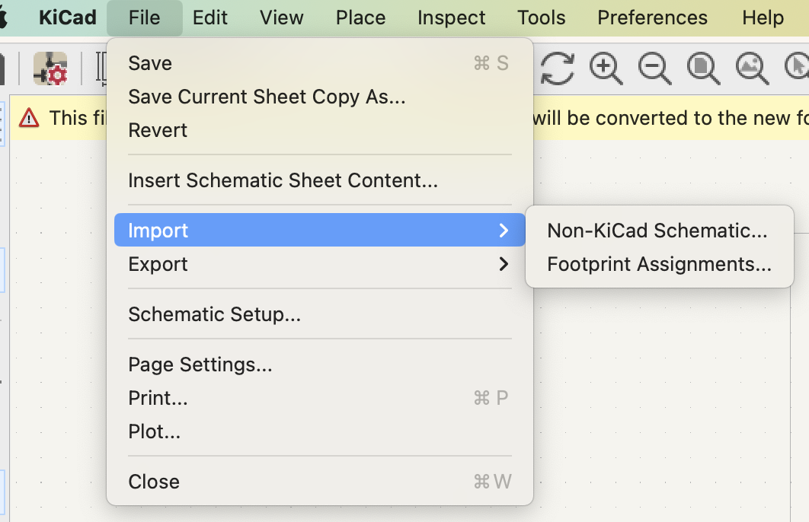

# How to use ecoEDA

This document provides an overview of how to use the key features of ecoEDA. If you have not yet, please follow the instructions on the [install](./INSTALL.md) page before reading further.

Jump to instruction sections of this doc:
[ecoEDA library generator](##ecoEDA-library-generator)
[Import previous schematics](##Import-previous-schematics)
[In-editor suggestions](##In-editor-suggestions)
[Bill of Teardowns](##Bill-of-Teardowns)
[ecoEDA Dashboard](##ecoEDA-Dashboard)
[Known bugs](##Known-bugs)

## ecoEDA library generator
To start, we provided an 'ecoEDA.kicad_sym' file so you can play around with the tool with our library of parts. This file stores your ecoEDA library. If you want to use your own library, feel free to delete that file and follow the instructions below.

First, to generate your ecoEDA library, you will need to provide the script with a .csv file listing out the components and their information to add to your library.

We've provided a [template_component_inventory.csv] (./ecoEDA/library files/template_component_inventory.csv) for you to inventory components in. There are several columns of data you'll need to fill out. You can also see an example [example_component_inventory.csv](./ecoEDA/library files/example_component_inventory.csv).

For each component, you'll have to fill out the following. Those with an underline are mandatory, the rest can be left blank if you can't find them. 
  *  **__Component Name__** - the identifier of the component or descriptive name (i.e. "100K Resistor")
  * **__Species__** - the type of component this is (Resistor, Button, Capacitor, Crystal, Speaker, Diode, LED, Display, IC, etc)
  * **__Genus__** - the more generic category of electronics component this falls under (Passive, Output, Sensor, Switch, etc.)
  * **__SMD vs THT__** - if the component is surface mounted or through-hole. Only put "SMD" or "THT" in this column.
  * **Value** - only necessary for passive components with value (i.e. 100KOhm, 200MOhm, 30uF, etc.) or to further specify the type of a component
  * **__Keywords__** - relevant descriptive keywords for the component (use component datasheet for help)
  * **__Description__** - description of component (use component datasheet for help, also use this space to describe any notes for component reuse)
  * **__Symbol-KICAD-URL__** - the KiCad symbol this component should be based on formatted as "<Symbol Library Name>:<Specific KiCad symbol name>". For custom KiCad symbols (or using ones from the internet), a different workflow is required (instructions coming soon).
  * **Footprint-KICAD-URL** - Similarly to Symbol-KICAD-URL, the footprint of this component as "<Footprint Library Name>:<Specific Footprint name>" if you can't find a relevant footprint in KiCad's default footprints library, put a link to an online symbol file (like on SnapEDA)
  * **Datasheet** - A URL to the official datasheet of the component
  * **__Source__** - name of the device the component is from
  * ** Teardown Link ** - a URL to online teardown of the source device (can be youtube video, blog post, etc.)
  * ** __Quantity__ ** - Number of this component from your device
  * ** PCB Designator ** - any labels on the device PCB corresponding to this component (i.e. R1, D2, U1, etc.)

To generate your file, go into the directory code/lib-tools/ and run:
```
python3 lib-generator.py <your csv file>
```
An updated ecoEDA.kicad-sym file should be produced. Make sure this is in the correct location (in code directory).

Now your ecoEDA library (ecoEDA.kicad_sym file) will be updated to include the components specified in your CSV!

## Import previous schematics
First, if you are using a previous *non-Kicad* schematic, use KiCad's tool to convert your schematic into one a KiCad version. See image below for how to find the feature on Mac.



In the directory code/lib-tools/, run:

```
python3 import_old_sch.py <your .kicad_sch file>
```
Now your ecoEDA library (ecoEDA.kicad_sym file) will be updated to include the components specified from your schematic! These will include information that they were sourced from your schematic's project name.

## In-editor suggestions
While you add components, whenever you save your schematic sheet, the plugin will monitor your changes and make suggestions to you. If you're starting with an already-made schematic, all you need to do is hit save and you should see a popup window appear.

You can click through the dialog to review suggestions. If you accept, the plugin will run a script to replace the component symbol with an "ecoEDA" symbol from our class inventory.

There will be a pop-up that asks if you want to revert to the last saved version of the schematic. Click "YES" -> this will allow your sheet to be updated in real-time with the new symbol.

You should be able to continue for all the symbols in your schematic. If there are no appropriate suggestions for you though, you can hit dismiss/cancel on these pop-ups and a suggestion for that component will not keep popping up.


## Bill of Teardowns

In your CLI, cd into your ecoEDA/code/ directory, then
```
cd BoT
python3 BoT_generator.py --file "<path to your kicad_sch file here"
open interactive_BoT.html
```
This should open a web page with a Bill of Teardowns in your default browser. You can use this to see all the sourced devices your schematic was made from and see teardowns of the devices if a teardown link was provided in the library.

## ecoEDA Dashboard
Same as for generating your Bill of Teardowns, cd into your ecoEDA directory, then
```
cd dashboard
python3 dashboard_generator.py
open ecoEDA_dashboard.html
```

## Known bugs
As with research projects, there are many bugs of our system. We are working on them! For now, please be aware of some issues we plan to target.

**Text and other decorative objects in the schematic can create issues with our program.** Please avoid them during the use of our tool *or* save backup copies!

**Windows: make sure to run this command after you close KiCAD so that there won't be parasitic KiCAD.** If you still aren't getting suggestions, there may be some stray processes that weren't properly closed/ended when you closed KiCad. In Kicad python scripting shell, you see errors "OSError: [WinError 10048] Only one usage of each socket address (protocol/network address/port) is normally permitted". You'll need to go to the task manager and close any KiCad related processes. This either shows up as “KiCad” or “<your project name> - KiCad”. You can also open another command prompt/powershell and run this command to kill all kicad processes:

```
taskkill /IM kicad.exe /F
```

**Windows: permission denied error in client**

Once you encounter this error, you have to restart kicad. Most importantly, make sure you have no other kicad running before you run kicad by running this command:

```
taskkill /IM kicad.exe /F
```

Then run kicad, and run the client again.

We aren't sure how to reproduce this error to debug. Let us know if you encounter this in reproducible way.

**The suggestions are not for the one that I added**

The code will automatically suggest all symbols on the schematics until you dismiss it. Just dismiss (click X) it if not needed. Manually pressing `ctrl + S` (windows) `cmd + S` (mac) will run through all symbols on the schematics.

**Copy and pasting from other sheets produces parsing errors**
Using copy and pasted symbols from other schematics produces some parsing errors in our tool and will create issues in writing an updated file. 
