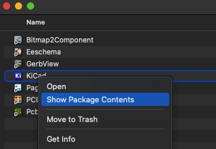
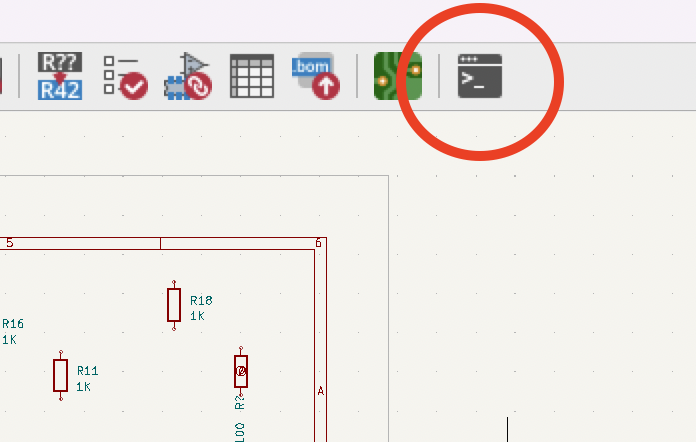
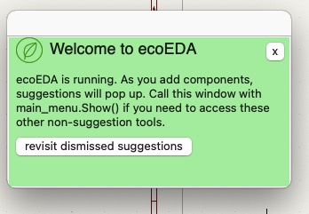

# Installing ecoEDA on KiCad

## Installations

  - Install [[https://www.kicad.org/|KiCad 7]] 
  - Install Python3
     * Once installed, make sure to install the following libraries
        * pip3 install python-osc
        * pip3 install sexpdata
  - Download this repo

## Setting up ecoEDA
  - First, go to `/Applications/KiCad/KiCad.app/Contents/SharedSupport/scripting/kicad\_pyshell` (Windows: `C:\Program Files\KiCad\7.0\share\kicad\scripting\kicad\_pyshell`)
    * If you're on mac and confused, right click on the KiCad App to see these folders.
    
  - Replace the [`__init__.py`](./ecoEDA/code/kicad-files/__init__.py) with the one from ecoEDA (in the folder ecoEDA/code/kicad-files/).
  - Change line 43-44 in `__init__.py` to reflect the location of your ecoEDA directory. For windows do the same for PyShell\_eeschema\_startup.py (Windows for example: `self.ecoEDA_dir = "C:\\Users\\<USER_NAME>\\Desktop\\ecocad\\"`  `self.fp_dir = "C:\\Program Files\\KiCad\\7.0\\share\\kicad\\footprints"`)
  - Via your CLI, you'll need to install a few packages in KiCad's specific Python. Go to `/Applications/KiCad/KiCad.app/Contents/Frameworks/Python.framework/Versions/3.8/bin` (Windows: `C:\Program Files\KiCad\7.0\bin\Scripts`)

Then do :
  * `./pip3.8 install wxPython`
  * `./pip3.8 install python-osc`
  * `./pip3.8 install sexpdata`

(may be pip3.9 instead of pip3.8)

Then on your python in terminal, you need to install this two packages:

  * `./pip3.8 install python-osc`
  * `./pip3.8 install sexpdata`

## Running ecoEDA

Make sure you have a KiCAD project and at least one component (e.g., R) on the schematic.

You'll need to run scripts locally (i.e. via a CLI/Terminal) and initiate a script in KiCad.

1. In one CLI instance, run `client.py`. You should do so with the command - `python3 client.py --file <.KICAD_SCH file you are workin on>`
2. In another CLI instance, run `server.py`. You should do so with the command - `python3 server.py --file <.KICAD_SCH file you are workin on>`

For example:

3. Last, press the PyShell button in KiCad. It's in the top right corner. 

When you open it, this should pop up:

