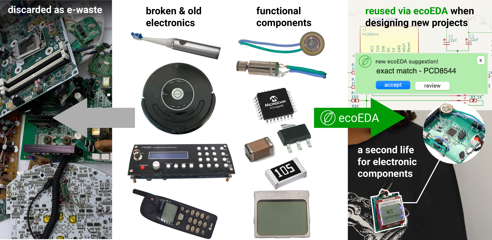
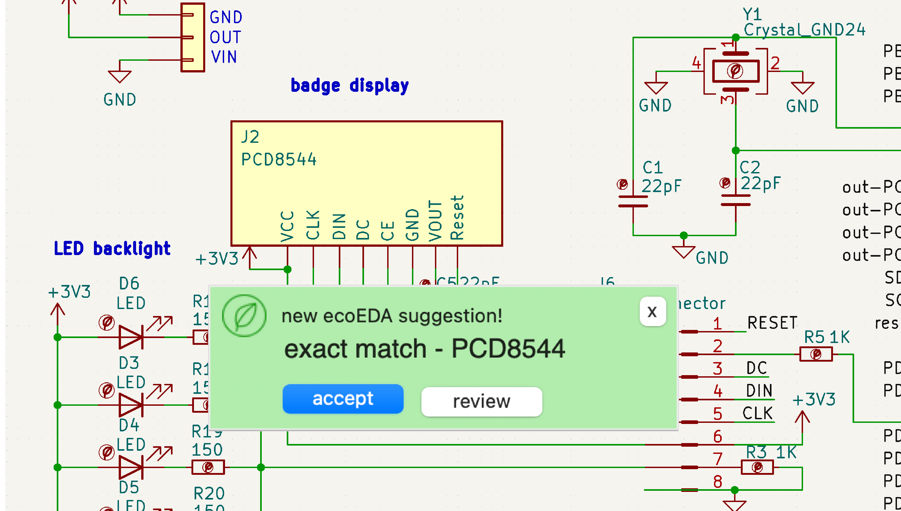
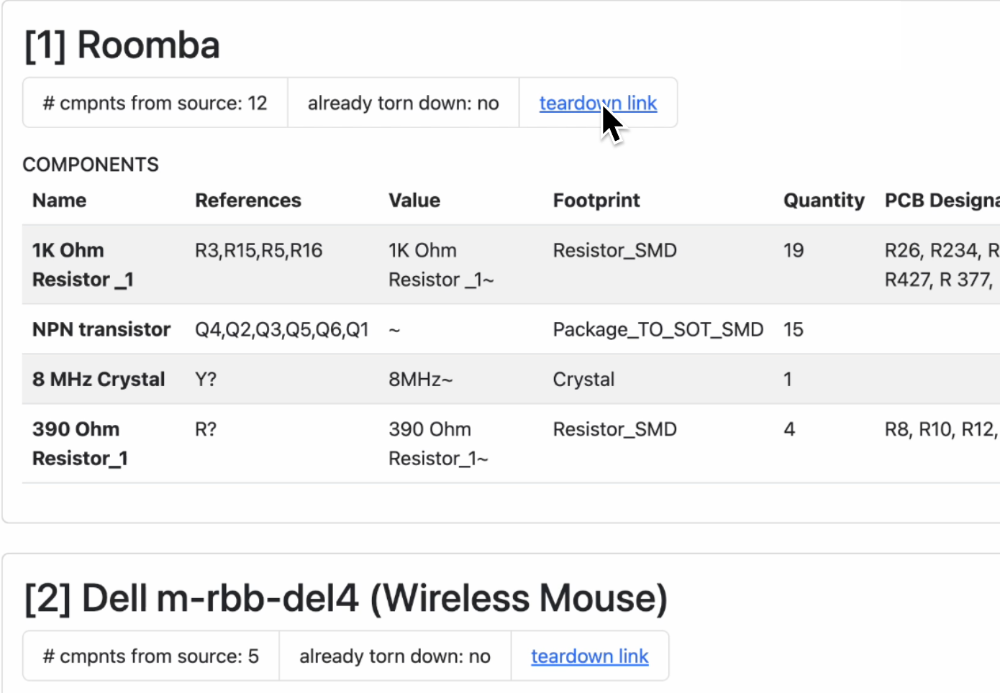

# ecoEDA: Recycling E-Waste during Electronics Design

This repository contains our software tool, ecoEDA, presented in the paper ["ecoEDA: Recycling E-Waste during Electronics Design"](https://doi.org/10.1145/3586183.3606745), which will appear at UIST2023. The smartwatch is a prototype exploring a living media interface that requires the user to care for the organism (slime mold, aka Physarum Polycephalum) that is integrated inside it in order for the functionality (it's heart rate sensor) to work. This tool was built by Jasmine Lu (@xjasminelu), Beza Desta (@Beza20), Joyce Passananti (@Joyce-Passananti) with project assistance from K.D. Wu, Romain Nith, and Pedro Lopes at the University of Chicago's [Human Computer Integration Lab](https://lab.plopes.org).

[Paper](https://lab.plopes.org/published/2023-UIST-ecoEDA.pdf) | [Video](https://youtu.be/XYMRXMVBfNg) 

## ecoEDA 
ecoEDA is a python-based tool that integrates with [KiCad](https://www.kicad.org/). It is designed to provide suggestions of recycled components whenever you add a new symbol to your schematic. 

### Features Overview

*ecoEDA library generator*
Users can create an ecoEDA library (library of electronic components recycled from e-waste) by using a spreadsheet (.csv) to inventory their parts and using our custom scripts to translate their inventory into a KiCad compatible ecoEDA library. This allows for use of these components when building schematics in KiCad. More details on the [how-to page](./HOWTO.md). 

*Import previous schematics*
To allow for reusing components from previous schematics. Users can use our custom script to import previous schematics to add their parts to their ecoEDA library. More details on the [how-to page](./HOWTO.md). 

*In-editor suggestions*
As you add new components to your schematic, ecoEDA will search through the libary to offer suggestions for potential replacements. These will appear as pop-ups on the side of your KiCad editor window. For a walkthrough of all our suggestion types and a preview of how these suggestions work, check out our [video](https://youtu.be/XYMRXMVBfNg).

Suggestion types include (1) exact-match: components that are exactly the same as the added component, (2) drop-in: components that aren't the same but have the same pin-out and footprint enabling easy swapping in, (3) exact-match, different footprint: components that are the same but have different footprints/packaging, (4) ranked suggestions: allowing users to see a full list of potentially relevant swaps and allow users to filter through this list by value or footprint, and (5) subcircuit suggestions: allowing users to swap in a subcircuit of multiple components from their library that achieve the same function as the original component. More details on the [how-to page](./HOWTO.md). 

*Bill of Teardowns*
To assist users with locating their parts and determining what e-waste devices will need to be torn down to source parts for their projects, ecoEDA will generate a bill of teardowns from your project. Similar to a bill of materials, it is a list grouped by source device of components used in your schematic. More details on the [how-to page](./HOWTO.md). 

*ecoEDA Dashboard*
To encourage users to keep up with their reuse progress, ecoEDA also tracks the number of projects you use ecoEDA on, the number of recycled parts you've used across projects, and more! More details on the [how-to page](./HOWTO.md). 

### How to install/use ecoEDA
To use ecoEDA, you must have installed KiCad (v7+) and Python3 on your machine. The system was built primarily with Mac OS. We have a version for Windows but please note that there have been several issues encountered for Windows.

Detailed instructions can be found on the page [INSTALL.md](./INSTALL.md)

### Submitting issues
As this tool was born out of a research project, it is a _prototype_. However, we'd love to hear about any bugs you might encounter during use of our tool. We encourage you to submit any issues that arise and we'll do our best to get around to them. Please note that there is only one (very busy) PhD student who will be able to provide support, so please extend us grace with any issues you encounter!

### Contributing
(adapted from [Clipy](https://github.com/Clipy/Clipy))
1. Fork it ( https://github.com/humancomputerintegration/ecoEDA/fork )
2. Create your feature branch (`git checkout -b my-new-feature`)
3. Commit your changes (`git commit -am 'Add some feature'`)
4. Push to the branch (`git push origin my-new-feature`)
5. Create a new Pull Request

## Citation

When using or building upon this work in an academic publication, please consider citing as follows:

Jasmine Lu, Beza Desta, K. D. Wu, Romain Nith, Joyce Passananti, and Pedro Lopes. 2023. ecoEDA: Recycling E-Waste during Electronics Design. In Proceedings of ACM Symposium on User Interface Software and Technology 2023 (UIST’2023). Association for Computing Machinery, New York, NY, USA. https://doi.org/10.1145/3586183.3606745

## Contact
For questions or if something is wrong with this repository, contact jasminelu@uchicago.edu
